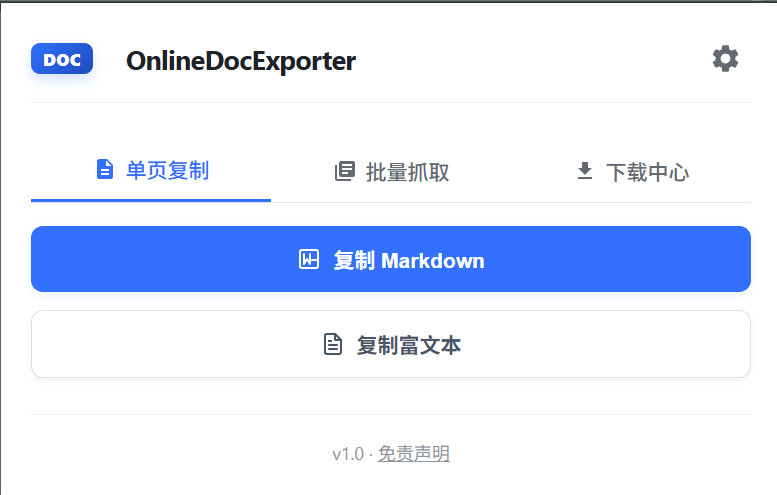
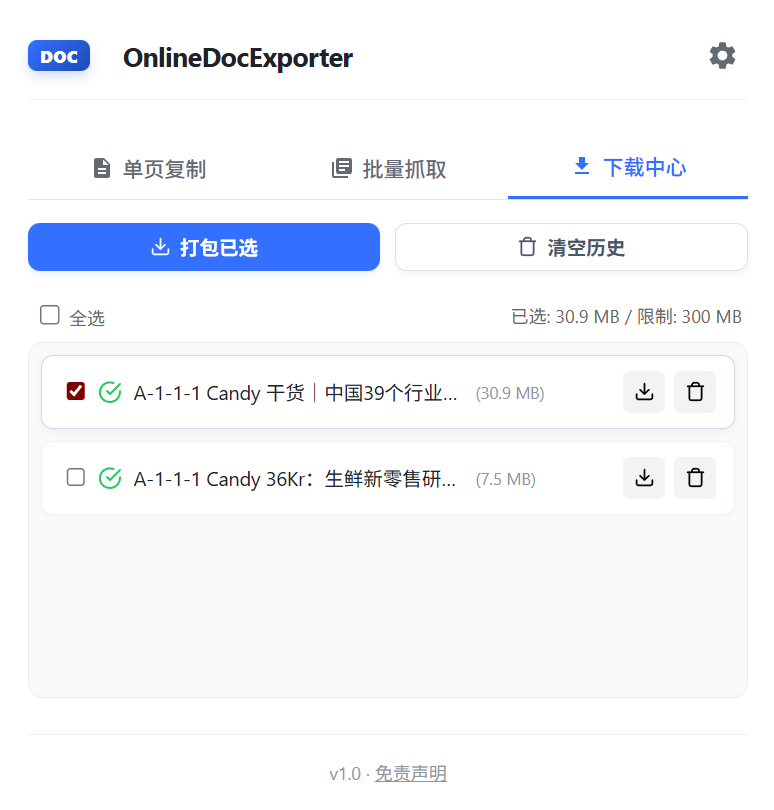
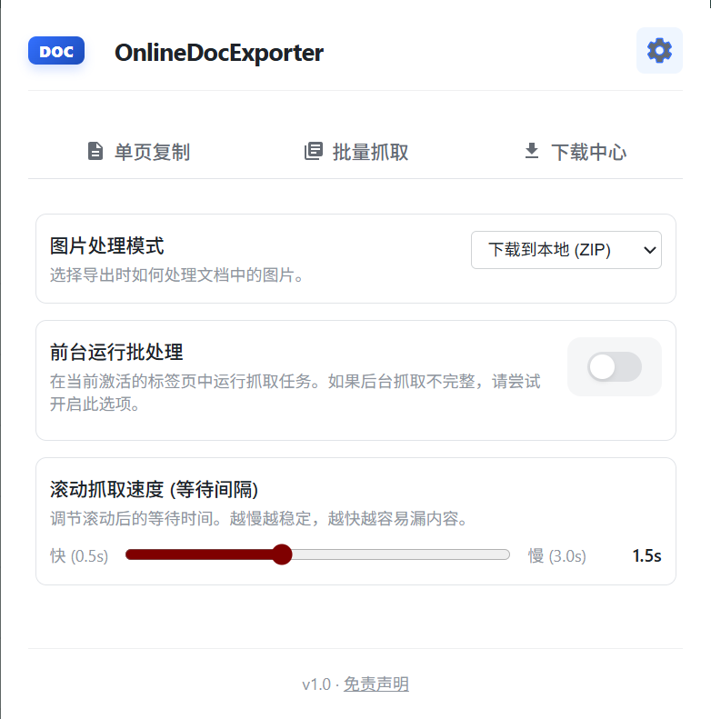

# 🚀 OnlineDocExporter (在线文档助手)

一款极致小巧、功能强大的在线文档转换与导出工具。支持将飞书/Lark 等文档（包括受保护无法复制的文档）一键转换为 Markdown、富文本或 PDF（含书签），并支持强大的批量下载功能。

---

## ⚠️ 免责声明 (Legal Disclaimer)

**在下载、安装或使用本软件前，请务必仔细阅读以下条款：**

1.  **用途限制**：本插件仅供**技术研究、学术探讨以及个人备份**自用。请勿将本插件用于任何商业用途、大规模非法抓取、侵犯版权或其他违反法律法规的行为。
2.  **合规性**：用户在使用本插件时，必须遵守所在地区法律法规及对应文档平台（如飞书、Lark等）的服务条款。由此产生的任何个人账号封禁、合规性风险或法律责任，均由**使用者自行承担**，开发者概不负责。
3.  **不提供担保**：开发者不对本软件的稳定性、准确性或安全性提供任何形式的担保。在任何情况下，开发者均不对因使用本软件而导致的任何数据丢失、法律纠纷或其他损害承担责任。
4.  **无版权侵犯意图**：本软件设计初衷是辅助用户进行个人知识管理。如果相关权利人认为本项目存在权益侵犯，请及时联系开发者，我们将配合进行处理。

**English Summary**: This extension is for educational and personal research purposes ONLY. By using this tool, you assume all risks and liabilities. The developer is NOT responsible for any account bans, data loss, or legal consequences resulting from the use of this project. Use it at your own risk.

---

## ✨ 核心特性

- **🚀 极速导出**: 一键将当前文档转换为 Markdown 或富文本。
- **📄 PDF 导出**: 一键下载为高质量 PDF，自动根据 H1/H2/H3 标题生成 **原生 PDF 书签**，静默生成无需打印对话框。
- **🤖 多平台适配**: 完美支持 **飞书/Lark** 文档及 **BOSS 直聘** 职位信息提取。
- **📦 批量抓取**: 自动扫描页面中的文档链接或职位卡片，支持选择 **Markdown 或 PDF** 格式，一键排队抓取。
- **🔗 智能合并**: 针对 BOSS 直聘等场景，支持将多篇内容自动合并为一份文档导出。
- **🔍 实时检测**: 插件 Popup 自动检测网页支持状态，智能切换抓取模式。
- **⚡ 下载中心**: 内置下载管理，支持打包为 ZIP，支持历史记录持久化。

## 📸 界面预览

  
  
  
  

## 🚀 快速上手

### 安装方法
1. 下载本项目或 Clone 到本地。
2. 打开 Chrome 浏览器，进入 `chrome://extensions/`。
3. 开启右上角的 **"开发者模式"**。
4. 点击 **"加载解压的扩展程序"**，选择本项目中的 `extension` 文件夹。

### 使用指南
1. **单页复制**:
   - 打开飞书/Lark 文档页面。
   - 点击插件图标，在设置区选择 **图片处理模式**（保留原链、Base64、本地打包或图床上传）。
   - 在“单页复制”面板选择 Markdown 或 富文本。
2. **PDF 导出** *(v1.5.0 新增)*:
   - 点击插件图标，选择 **"下载为 PDF"**。
   - 插件自动提取文档内容，通过 Chrome DevTools Protocol 生成高品质 PDF。
   - PDF 自动包含 **书签目录**（基于 H1/H2/H3 标题结构），便于大文档导航。
3. **批量抓取**:
   - 在包含多个文档链接的页面（如知识库首页、列表页）点击“批量抓取”。
   - 点击“扫描链接”，选择导出格式（Markdown 或 PDF），勾选目标文档后点击“开始抓取”。
   - 批量 PDF 导出时，每篇文档自动生成带书签目录的高品质 PDF。
4. **高级设置 (图床/本地)**:
   - 点击右上角设置图标，可以配置 OSS/MinIO/S3 的详细参数。
   - 如果选择“下载到本地 (ZIP)”，抓取完成后在下载中心打包下载时，图片会自动包含在压缩包中。
5. **下载管理**:
   - 进入“下载中心”，查看抓取进度。
   - 抓取完成后可单独下载或点击“打包下载”获取所有文件。

## 🗺️ 未来规划 (Roadmap)

- [x] **批量抓取与打包下载** (已上线)
- [x] **图片本地化处理** (已上线)
- [x] **自动图床上传** (已上线)
- [x] **BOSS 直聘招聘信息提取** (v1.3.0)
- [x] **智能网站支持检测** (v1.3.0)
- [x] **UI 极简风格重构与下载中心优化** (v1.4.0)
- [x] **PDF 导出与原生书签** (v1.5.0)
- [x] **批量 PDF 导出** (v1.6.0): 批量抓取支持选择 PDF 格式，自动生成带书签的 PDF 并存入下载中心，支持打包下载。
- [x] **滚动扫描、失败重试与分卷打包** (v1.6.1): 新增自动滚动扫描链接、失败任务一键重试，以及大批量导出按卷自动拆分 ZIP。
- [x] **批量图片命名与标题清洗优化** (v1.6.2): 本地图片按任务标题分目录并使用短哈希命名，修复扫描结果中 `Shortcut:` 前缀残留。
- [ ] **多平台兼容**: 持续扩展支持 语雀、钉钉文档、Notion 等。
- [ ] **自定义模版**: 允许用户自定义导出的 Markdown 样式与 Frontmatter。

## 🛠️ 技术内幕

- **Manifest**: Chromium V3
- **JS 核心**: 原生 ES6+，无框架依赖，轻量快速
- **样式**: CSS 变量驱动的现代设计系统
- **库支持**: [JSZip](https://stuk.github.io/jszip/) 用于批量文件打包

<h2 id="sponsor">☕ 请我喝杯咖啡 (Sponsor)</h2>

如果这个项目帮助你节省了时间，不妨请作者喝杯咖啡，鼓励他继续维护！

  
<strong>🥤 点击请我喝杯咖啡 / Click to Sponsor (WeChat Pay)</strong>

   
  

    
      
    <i>感谢您的支持，這將成为我持续维护的动力！</i>
  

## 🤝 贡献与反馈

欢迎提交 Issue 或 Pull Request 来改进这个项目！
